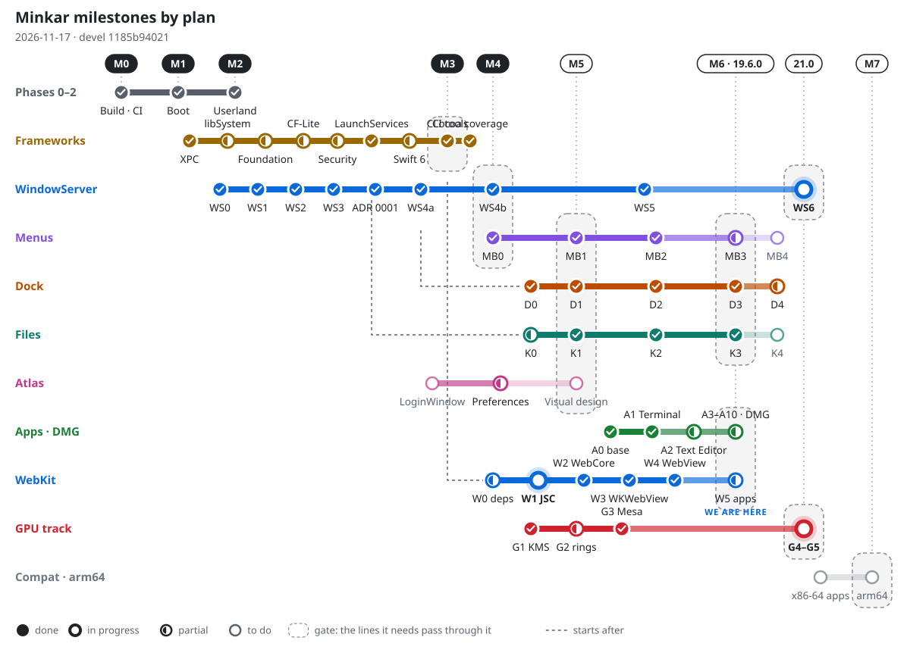
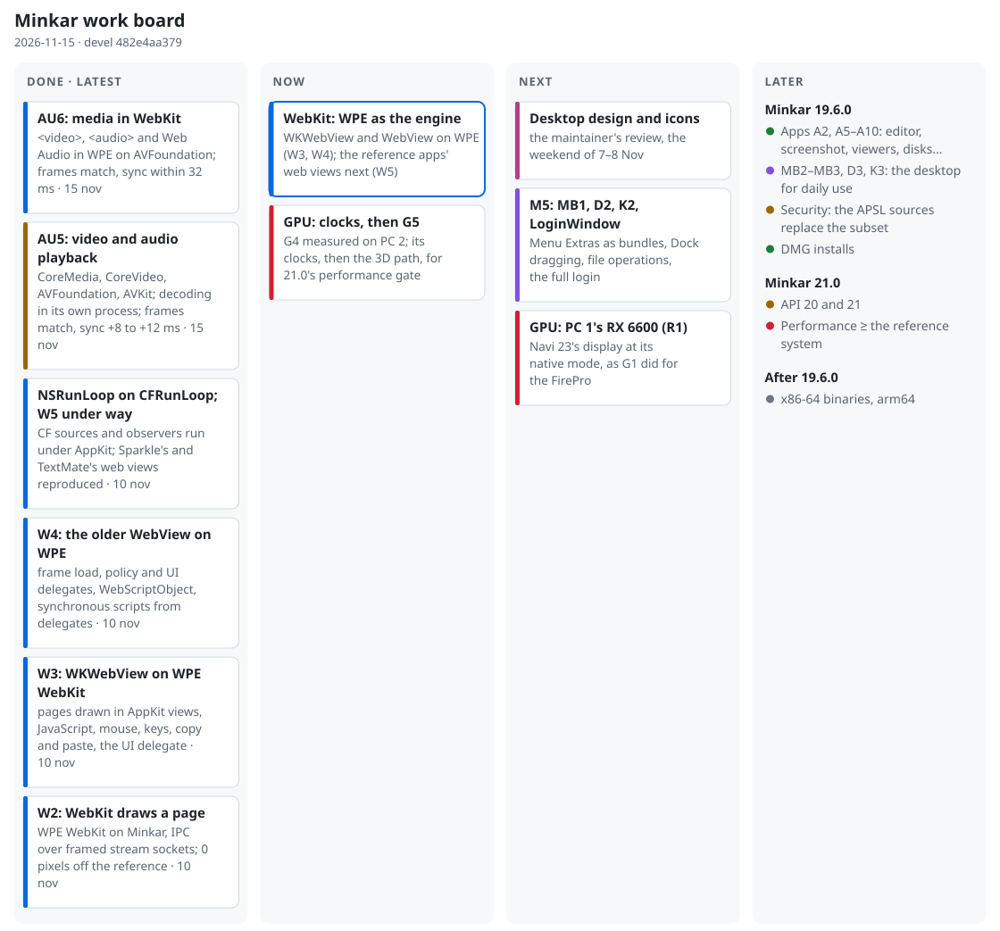

# Minkar — El avance de un vistazo

Esta página se genera desde [progress/status.toml](progress/status.toml) con
`bmake progress`; [ROADMAP.md](ROADMAP.md) (en inglés) es la fuente de verdad, y
[ROADMAP.es.md](ROADMAP.es.md) su versión en español. En inglés:
[Progress.md](Progress.md).

<!-- progress:summary:begin -->
_Actualizado el 2026-11-20, devel `1aaa4bfb8b`_

| Plan | Avance |  | Ahora | Siguiente |
| --- | --- | --- | --- | --- |
| **Gates** | 🟩🟩🟩🟩🟩🟦⬜⬜ | 5 / 8 | M5 Atlas desktop | M6 Minkar 19.6.0 |
| [Phases 0–2](ROADMAP.es.md) | 🟩🟩🟩 | 3 / 3 | — | — |
| [Frameworks](ROADMAP.es.md#fase-3--frameworks-base-y-swift) | 🟩🟨🟨🟨🟨🟩🟨🟩🟩 | 4 / 9 | libSystem, Foundation, CF-Lite, Security, Swift 6 | — |
| [WindowServer](WindowServer-Rewrite.es.md) | 🟩🟩🟩🟩🟩🟩🟩🟩🟦 | 8 / 9 | WS6 | — |
| [Menus](Atlas.es.md#3-menús) | 🟩🟩🟩🟨⬜ | 3 / 5 | MB3 | MB4 |
| [Dock](Atlas.es.md#4-dock-y-files) | 🟩🟩🟩🟩🟨 | 4 / 5 | D4 | — |
| [Files](Atlas.es.md#4-dock-y-files) | 🟨🟩🟩🟩⬜ | 3 / 5 | K0 | K4 |
| [Atlas](ROADMAP.es.md#fase-5--escritorio-atlas) | ⬜🟨⬜ | 0 / 3 | Preferences | LoginWindow |
| [Apps · DMG](Atlas.es.md#5-aplicaciones) | 🟩🟩🟨🟨⬜ | 2 / 5 | A2 Text Editor, A3–A4 · DMG | A5–A10 |
| [WebKit](ROADMAP.es.md#fase-3--frameworks-base-y-swift) | 🟨🟦🟩🟩🟩🟨 | 3 / 6 | W1 JSC | — |
| [GPU track](ROADMAP.es.md#pila-gráfica-componentes-y-secuencia) | 🟩🟨🟩🟦 | 2 / 4 | G4–G5 | — |
| [Audio](ROADMAP.es.md#fase-3--frameworks-base-y-swift) | 🟩⬜ | 1 / 2 | — | AU7–AU10 |
| [Lane BC](ROADMAP.es.md#carril-bc--compatibilidad-binaria) | 🟩🟦🟩🟨⬜⬜⬜ | 2 / 7 | BC0 gate | BC3 ABI |
| [Lane KX](ROADMAP.es.md#carril-kx--kernel-nuevo-darwin-25) | 🟦⬜⬜⬜ | 0 / 4 | KX0 ADR | KX1 M2 |
| [Lane ARM](ROADMAP.es.md#carril-arm--arm64) | 🟦⬜⬜⬜ | 0 / 4 | ARM0 build | ARM1 M2 |
| [Lane SU](ROADMAP.es.md#carril-su--swiftui-sobre-openswiftui) | 🟦🟦⬜⬜⬜⬜ | 0 / 6 | SU0 report, SU0b review | SU1 import |

🟩 hecho · 🟦 en curso · 🟨 parcial · ⬜ por hacer
<!-- progress:summary:end -->

## Hitos por plan

<picture>
  <source media="(prefers-color-scheme: dark)" srcset="progress/metro-dark.svg">
  
</picture>

Planes: [ROADMAP.es.md](ROADMAP.es.md) · [WindowServer-Rewrite.es.md](WindowServer-Rewrite.es.md) ·
[Atlas.es.md](Atlas.es.md)

## Tablero de trabajo

<picture>
  <source media="(prefers-color-scheme: dark)" srcset="progress/board-dark.svg">
  
</picture>
